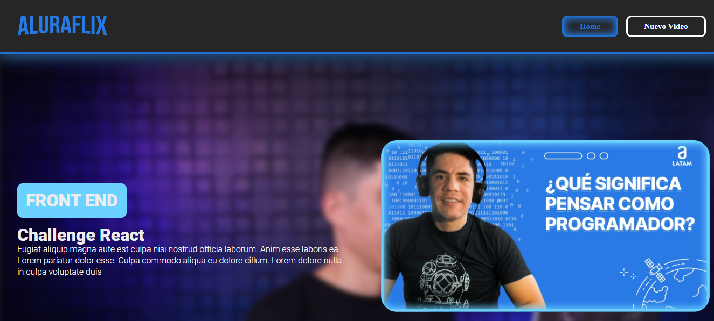
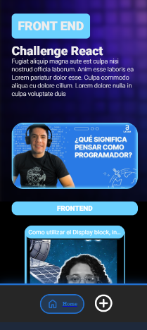

# Alura Geek

AluraGeek es un proyecto para demostrar competencias en el desarrollo web usando HTML5, CSS3, Javascript, ReactJS y otras tecnologias, basado en un prototipo realizado en Figma

### Pre-requisitos 📋

```
* Navegador web compatible (Chrome, Edge)
* NodeJs
* Visual Studio Code
* Extension VS :: LiveServer
* Extension VS :: json-server
* Responsively App
```

### Instalación 🔧

1. Clonar el proyecto

```
https://github.com/Seba-Monsalve/alura-aluraflix
```

2.  Instalar json-server

  ```
  npm i json-server
  ```

3. Desde un terminal, ejecutar json-server con el parametro -watch

```
npx -watch json-server data/db.json
```

4. Ejecutar 
   
```
npm run dev
```

## Visualizacion

# Desktop
  


# Tablet

 

# Mobile


****
# Highlights
* Responsive
* Uso de StyledComponents (herencia, mediaquerys)
* Uso de useContext para gestor de estados
* Simulacion y comunicacion con **API**

## Notas

* Se dispone de un json de prueba llamado 'db.json' con el cual puedes hacer pruebas
* Por problemas de CORS, no es posible reflejar el estado en la base de datos en **peticiones POST y PUT.**

## Autores ✒️

* [Seba Monsalve](https://github.com/seba-monsalve)
  
## Expresiones de Gratitud 🎁

* Gracias a [Alura](https://www.aluracursos.com/) y sus instructores por estas oportunidades de enseñanza y practica
* Plantilla Readme por [Villanuevand](https://github.com/Villanuevand) 😊
